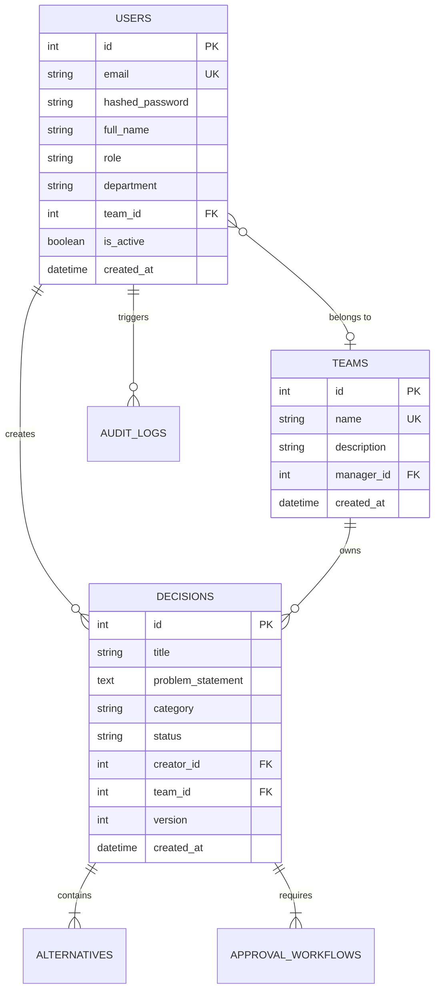

# 🧠 Expert Decision Replay Platform

> **A centralized platform for capturing, managing, reviewing, and replaying expert organizational decision-making processes.**

[](https://www.python.org/)
[](https://fastapi.tiangolo.com/)
[](https://www.sqlalchemy.org/)
[](https://jwt.io/)
[](#-milestone-1-deliverables--status)
[](#-automated-tests--verification)

---

## 📄 Milestone 1 Final Submission & Verification Report

The comprehensive **Milestone 1 Completion Report** is ready for mentor review and evaluation:

* 📥 **[Download Milestone 1 Completion Report (PDF)](docs/Expert_Decision_Replay_Platform_Milestone_1_Report.pdf)**
* 🌐 **Direct Download via API:** `http://127.0.0.1:8000/api/download-milestone1-pdf`

---

## 🎯 Milestone 1 Deliverables & Status (Week 1–2)

All key deliverables outlined in the Milestone 1 curriculum have been implemented and verified:

| Task / Module | Scope & Implementation | Deliverable Path | Status |
| :--- | :--- | :--- | :---: |
| **Requirement Analysis** | Detailed problem statement, functional specifications, role permissions, and metrics. | [`docs/requirements.md`](docs/requirements.md) | ✅ **Completed** |
| **Database Design** | Normalized relational schema with 6 models: Users, Teams, Decisions, Alternatives, Approvals, Audit Logs. | [`app/models.py`](app/models.py)<br/>[`docs/database_design.md`](docs/database_design.md) | ✅ **Completed** |
| **FastAPI Backend Setup** | ASGI application with modular routers, CORS middleware, Pydantic schemas, and seed script. | [`app/main.py`](app/main.py)<br/>[`app/schemas.py`](app/schemas.py) | ✅ **Completed** |
| **Authentication System** | JWT bearer token authentication, PBKDF2/SHA-256 password hashing, token validation middleware. | [`app/auth.py`](app/auth.py)<br/>[`app/routers/auth_router.py`](app/routers/auth_router.py) | ✅ **Completed** |
| **User & Role Management** | 4-tier Role-Based Access Control (`Employee`, `Reviewer`, `Manager`, `Administrator`). | [`app/routers/users_router.py`](app/routers/users_router.py) | ✅ **Completed** |
| **UI Wireframes & Specs** | Glassmorphic web UI, interactive ER schema visualizer, and live database explorer. | [`static/index.html`](static/index.html)<br/>[`docs/wireframes.md`](docs/wireframes.md) | ✅ **Completed** |
| **Automated Verification** | 12 automated unit & API integration tests covering auth, RBAC security, and DB constraints. | [`tests/test_milestone1.py`](tests/test_milestone1.py) | ✅ **12/12 Passed** |

---

## 👥 Role-Based Access Control (RBAC)

The platform supports four hierarchical user roles:

1. 👨‍💻 **Employee**: Create decision drafts, formulate alternatives (pros/cons/costs), view team activity.
2. 🔍 **Reviewer**: Technical evaluation of options, feasibility scoring, review approvals/rejections.
3. 👔 **Manager**: Departmental team management, final decision approval workflows, team metrics.
4. 🛡️ **Administrator**: Complete user lifecycle management, role privileges, system audit logs.

---

## 🗄️ Entity Relational (ER) Model



---

## 🚀 Quick Start Guide

### 1. Prerequisites & Setup
```bash
# Clone the repository
git clone <repository_url>
cd python_proj

# Install dependencies
pip install -r requirements.txt
```

### 2. Run the Application
```bash
python run.py
```
* 🌐 **Interactive Web UI**: [http://127.0.0.1:8000](http://127.0.0.1:8000)
* 📖 **Interactive Swagger API Docs**: [http://127.0.0.1:8000/docs](http://127.0.0.1:8000/docs)
* 📥 **Download Milestone 1 PDF Report**: [http://127.0.0.1:8000/api/download-milestone1-pdf](http://127.0.0.1:8000/api/download-milestone1-pdf)

### 3. Run Automated Tests
```bash
pytest
```
*Output: `12 passed in 1.43s` (100% pass rate)*

---

## 📋 Evaluation Criteria & Mentor Sign-Off (Week 2)

- [x] **Authentication Completed:** JWT tokens issued, verified, and protected.
- [x] **User Management Functional:** CRUD endpoints, 4 roles with privilege enforcement.
- [x] **Database Finalized:** SQLAlchemy models, foreign keys, and seed data populated.
- [x] **UI Wireframes & Documentation:** Live interactive visualizer and markdown documentation.
