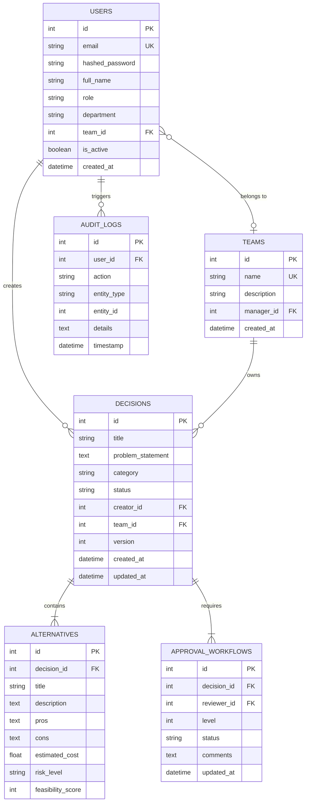

# Database Design & ER Specification
## Expert Decision Replay Platform

### Entity Relationship Model

### Table Definitions & Field Types
1. **`users`**: User identity, roles (`Employee`, `Reviewer`, `Manager`, `Administrator`), and team membership.
2. **`teams`**: Organizational teams managed by department managers.
3. **`decisions`**: Core decision records with status state machine (`Draft` -> `Under Review` -> `Approved` / `Rejected` -> `Archived`).
4. **`alternatives`**: Multi-option comparisons evaluated per decision.
5. **`approval_workflows`**: Multi-tier reviewer approvals.
6. **`audit_logs`**: Immutable audit logs capturing user actions, privilege escalation, and logins.
